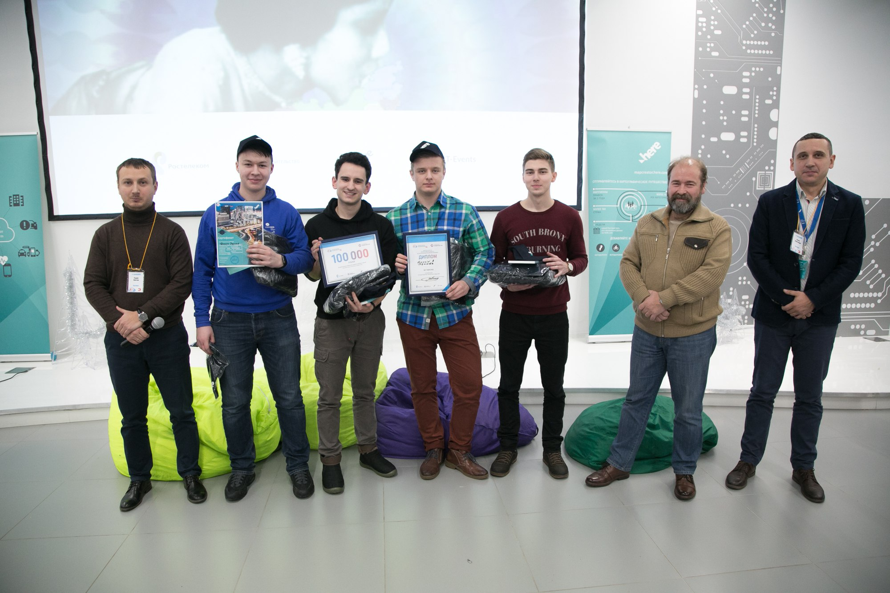

# LovelyGIS-Hackathon
[Первая новость о хакатоне](https://opendata71.ru/events/news/4699962/)  
Декабрь, 2017

## Предыстория

Хакатон был организован в рамках Третьего конкурса "Открытые данные" Российской Федерации ([Открытое правительство](https://open.gov.ru/)) и компанией [HERE](https://www.here.com/).

В рамках хакатона мы реализовали iOS-приложение, главной фичей которого были рекомендации наиболее интересных культурных событий поблизости.

## iOS Приложение
Что вам приходит в голову, когда речь идет о культурных событиях? **Выставки, музеи, театры, публичныые чтения и выступления, концерты**. Всё это является частью нашей культурной жизни. Однако люди (особенно молодые) часто предпочитают другой отдых, а ведь вокруг столько интересных мероприятий!

Мы переосмыслили то, как нужно рассказывать о предстоящих мероприятиях. Все любят **мемы**, но мало кто слышал о предстоящих выставках. Так почему бы не совместить приятное с полезным? :)

Рассказывать друг другу о новых культурных событиях теперь стало просто и интересно.

Мы продумали пользовательский интерфейс до самых мелочей.

  

Одной из ключевых фич стала крайне интуитивная система подбора мероприятий, учитывающая ряд особенных признаков. Например, **хайповость** культурного события.

## Развитие идеи

Разработанное в рамках хакатона приложение в дальнейшем продолжило своё существование как более серьёзный проект: **in.Place**.

## И наша награда

[VK хакатона](https://vk.com/album-155634075_250162776)  
[Facebook хакатона](https://www.facebook.com/media/set/?set=a.888874914612848&type=3)  
[Instagram хакатона](https://www.instagram.com/p/BdDFAkGDHps/?tagged=lovelygis)  

## Участники

Артём Куприянов (@ArtemKupriyanov)  
Ярослав Спирин (@mountain-viewer)  
Стас Округ (@Konagmo)  
Илья Захаркин (@izakharkin)  
